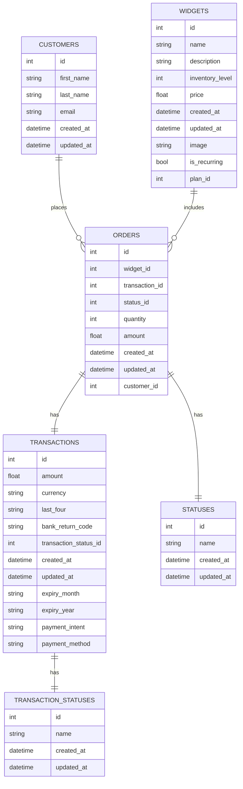

# 🛒 Go E-commerce
Welcome to the Go E-commerce repository! This project demonstrates building a comprehensive e-commerce platform using Go

## 📋 Table of Contents
- Features
- Demo
- Database ER Diagrams

## ✨ Features
- Front-end and back-end built in Go
- Processing credit card transactions
- Creating plan subscriptions
- Authentication on front and back ends
- Session authentication with username/password
- Stateful tokens for API authentication
- Password resets for users
- User management (Add, Edit, Delete)
- Microservice for generating and emailing invoice PDFs

##  🎥 Demo
- Home page to display products
- Buy a single product and charge user's credit card
- User receipt
- Subscribe to a plan
- Admin login and control panels
- Virtual terminal for admin to charge a credit card on demand
- View all sales and subscriptions
- Manage admin users, including adding new users and updating user information
- Forgot password and reset password functionality

## 🗄️ Database ER Diagrams

> This schema supports a full e-commerce workflow, from customer management to order processing and payment handling. It allows for tracking the status of both orders and transactions separately, which is useful for handling complex scenarios like failed payments or order cancellations.

####  Workflow implied by these relationships:

**a) Customer Registration:**

A new customer record is created in the customers table with their personal information.

**b) Product Browsing:**

Widgets (products) are stored in the widgets table with details like price, inventory level, and description.

**c) Placing an Order:**

When a customer decides to buy a widget, a new record is created in the orders table.
This record includes references to the customer (customer_id), the widget (widget_id), and the quantity.
An initial status is assigned to the order (status_id).

**d) Payment Processing:**

A new record is created in the transactions table when the customer attempts to pay.
This includes payment details like amount, currency, and last four digits of the payment method.
The transaction is given a status (transaction_status_id).

**e) Order Fulfillment:**

As the order progresses, its status in the orders table may be updated.
The transaction status may also be updated as payment is processed.

**f) Inventory Management:**

The inventory_level in the widgets table would be updated after a successful order.

**g) Recurring Orders:**

The is_recurring field in the widgets table suggests that some products might be part of a subscription or recurring order system.
